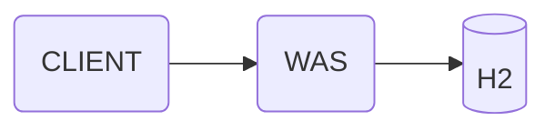
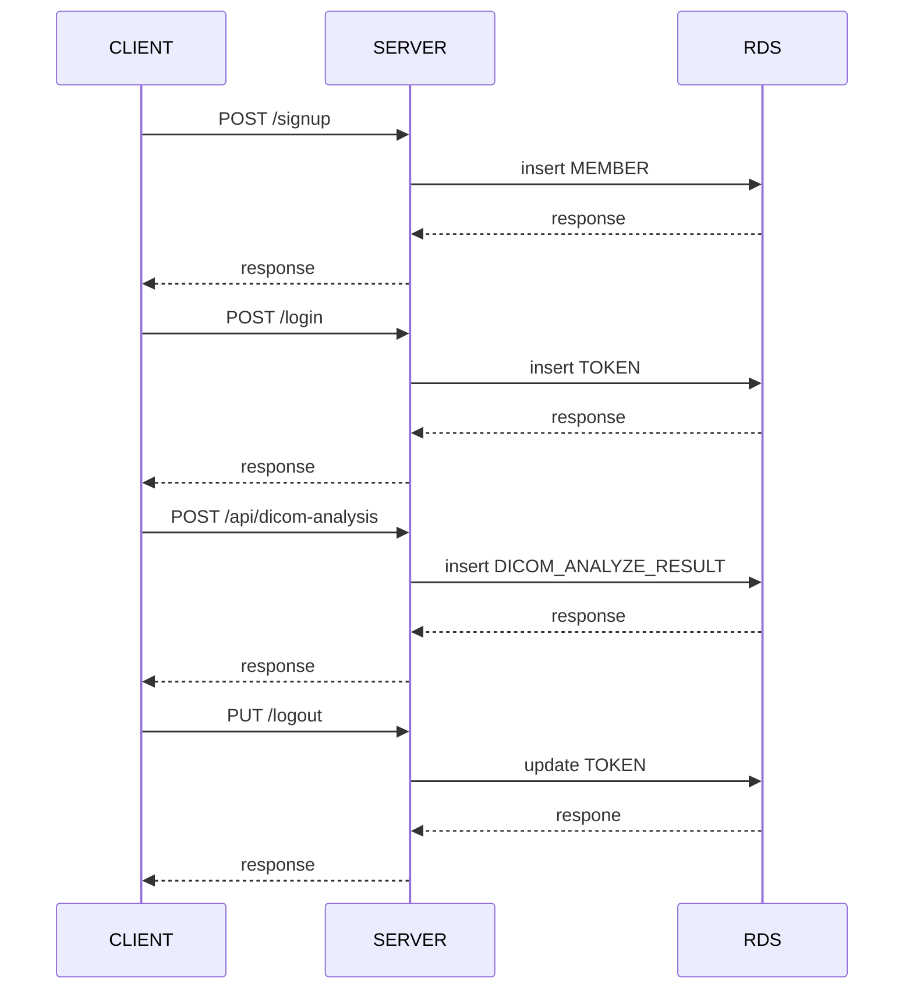
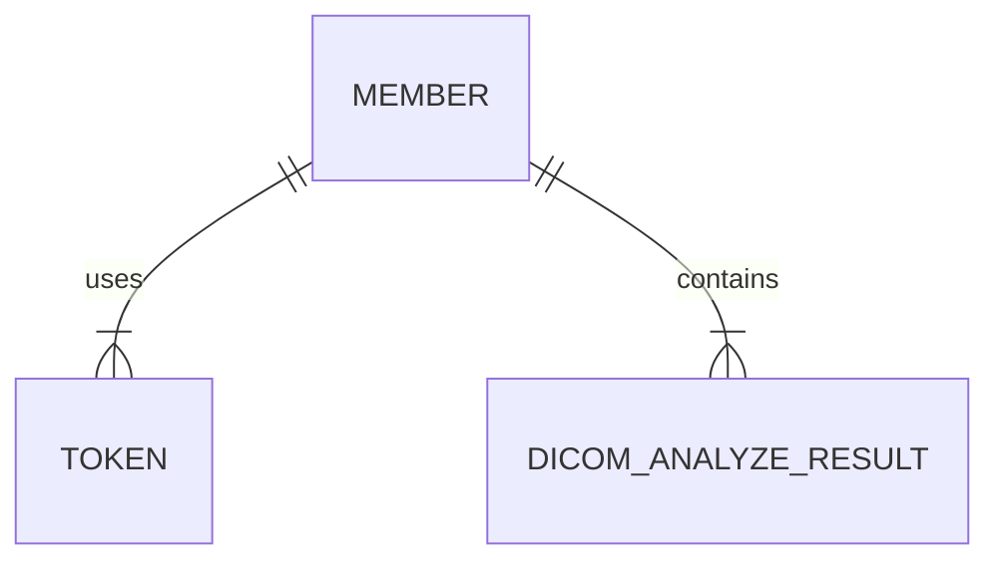
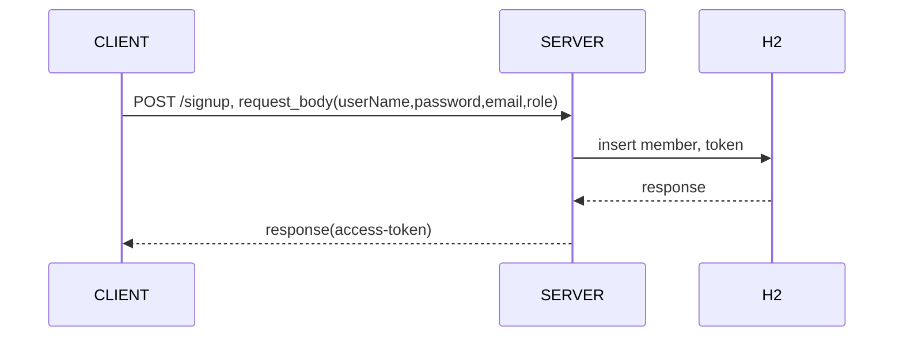
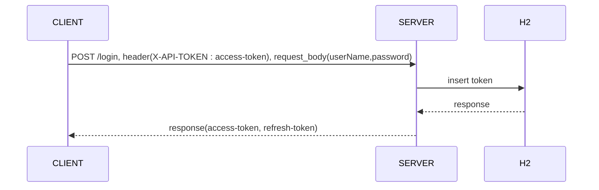
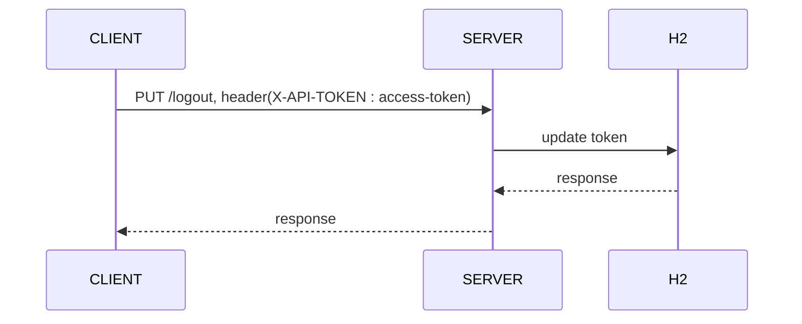
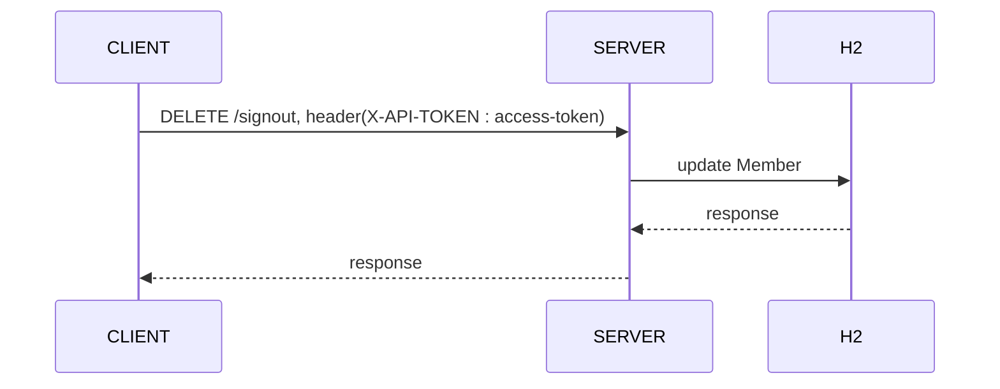
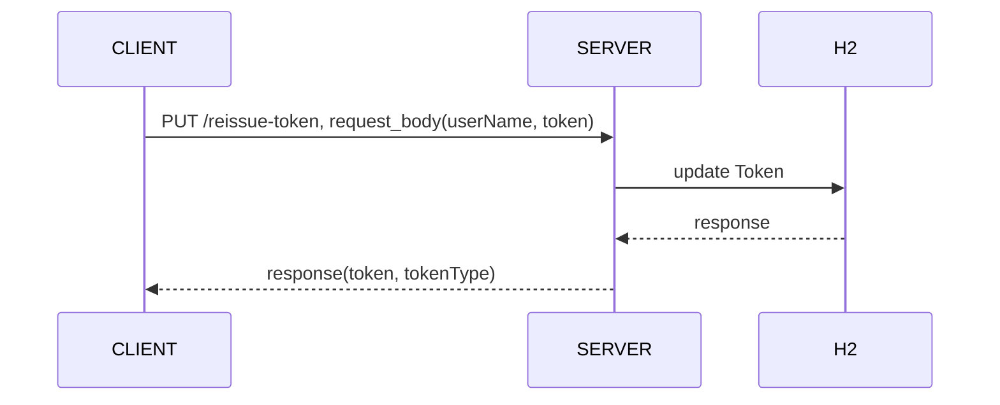
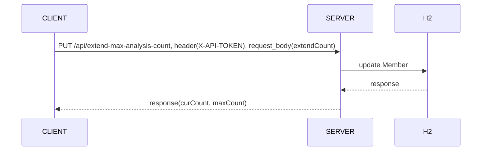
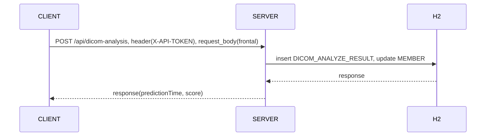

# 시스템 설계도



- 해당 시스템은 과제라는 특성상 이용자수가 10명 이하이기 때문에 WAS 와 RDBMS 인 H2로 이루어진 모놀리식 서버를 설계했습니다
- 많은 트래픽이 발생하지 않기 때문에 디버깅이 용이한 Spring MVC 스택을 이용하여 서버를 세팅하였습니다
- 대량의 데이터를 통신하지 않기 때문에 클라이언트와의 통신 프로토콜은 Restful API 를 사용하였습니다
- 또한 많은 데이터가 발생하지 않고 제한적인 시간안에 만들어야 하는 서버이기 때문에 빠르게 설치와 실행이 가능한 H2데이터베이스를 선택했습니다
- 간단한 CRUD 에 대한 개발 속도를 높이기 위해 Spring Data JPA 를 선택했습니다
- 인증/인가 방식은 JWT, Spring Security 를 사용하여 구현하였습니다

### 패키지 구조

- api : 클라이언트와의 통신을 담당하는 로직들은 모아놓은 패키지입니다. controller, service 클래스들이 위치해 있습니다
- common : 공통적으로 적용되야 하는 configuration, filter, exception 등을 모아놓은 페키지입니다
- domain : 서비스의 도메인을 정의하는 entity 와 repository 등이 위치해 있습니다

### API 호출 흐름도



# ERD



# 기능 리스트

1. 클라이언트 가입 API

- 회원 가입을 위한 API 입니다

```
request body
{
    "userName": "kimho314", // 아이디
    "password": "ghtjq2959@", // 비밀번호
    "email": "kimho314@gmail.com", // 이메일 주소
    "role": "CLIENT" // 클라이언트 권한
}
```



2. 로그인 API

- 회원 로그인을 위한 API 입니다
- 가입 후 응답값으로 받은 access-token을 header에다가 넘겨주시면 됩니다

```
header
--header 'X-API-TOKEN: <access-token>
--request body
{
    "userName": "kimho314", // 아이디
    "password": "ghtjq2959@" // 비밀번호
}
```



3. 로그아웃 API

- 로그아웃을 위한 API 입니다
- 로그인 후 응답값으로 받은 access-token을 header에다가 넘겨주시면 됩니다

```
--header 'X-API-TOKEN: <access-token>
```



4. 클라이언트 탈퇴 API

- 탈퇴를 위한 API 입니다

```
--header 'X-API-TOKEN: <access-token>
```



5. 클라이언트 토큰 재발급 API

- 유효 기간이 만료된 토큰 재발급용 API 입니다

```
--header 'Content-Type: application/json' \
--request body '{
    "userName" : "kimho314", // 아이디
    "token" : "<access-token>"
}
```



6. 클라이언트 영상 분석 수 연장 API

- 영상 분석 수 연장 API 입니다

```
--header 'Content-Type: application/json' \
--request body '{
    "extendCount" : 100 // 연장할 갯수
}'
```



7. 영상 분석 API

- 영산 분석 API 입니다

```
--header 'X-API-TOKEN: <access-token>' \
--form 'frontal=@"/E:/lunit_assignment/cr_samples/1_Nodule.dcm"'
```



# 실행 방법

- docker-compose.yml이 위치한 디렉토리로 이동합니다
- 이동한 디렉토리에서 docker-compose up 명령어를 실행합니다
- http://localhost:8080/<uri>로 호출하면 됩니다