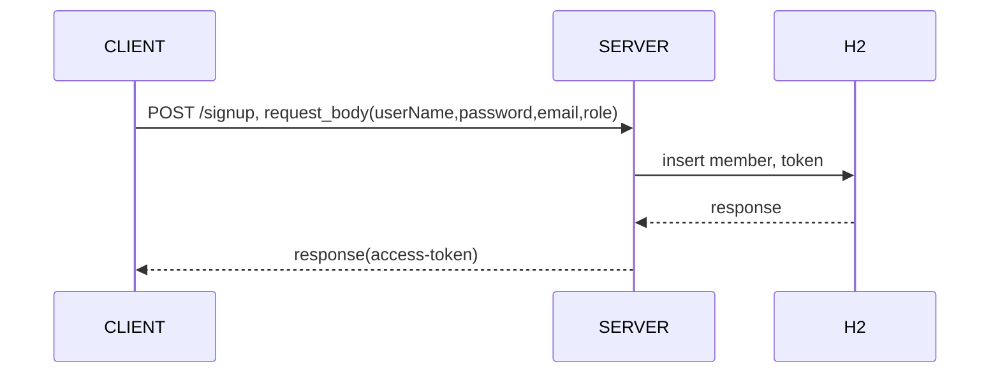
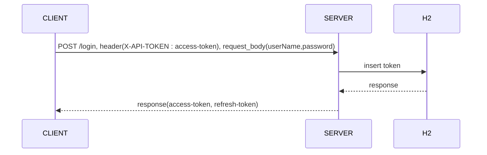
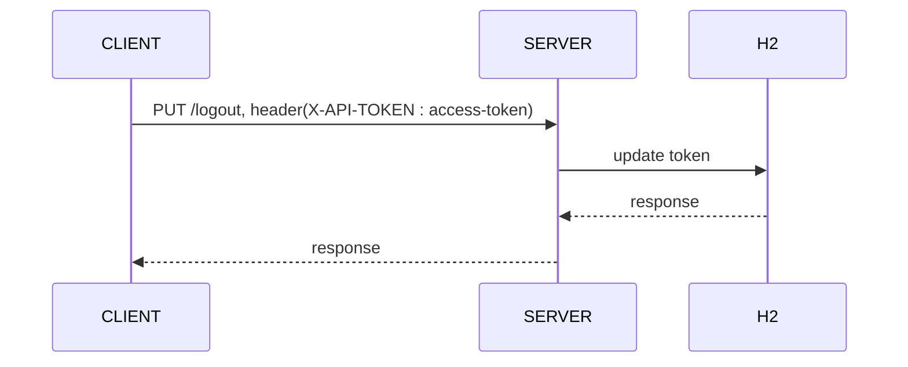
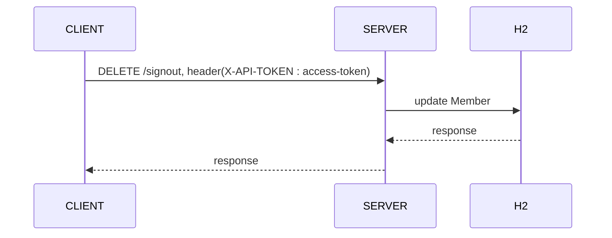
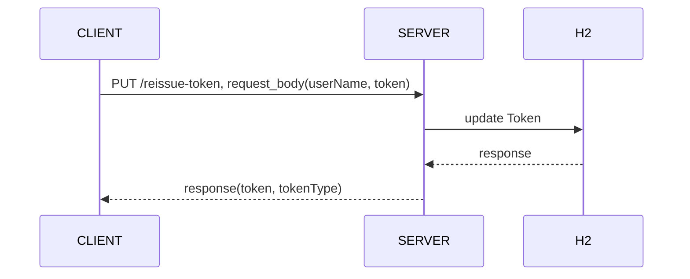
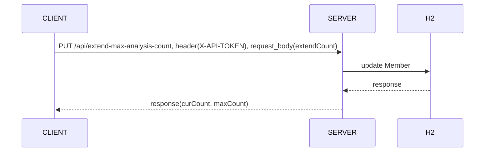
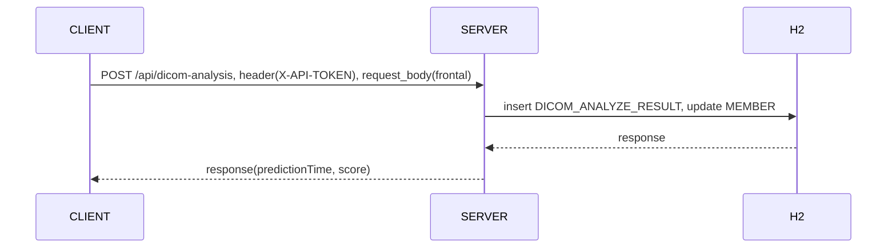
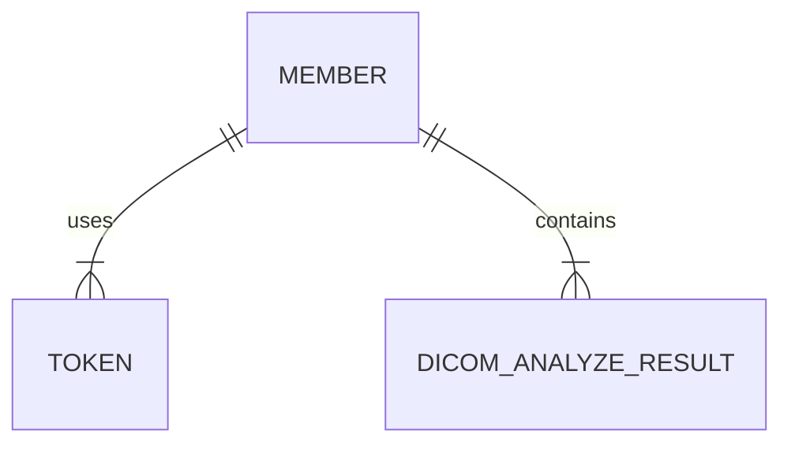

# 기능 리스트

1. 클라이언트 가입 API

- 회원 가입을 위한 API 입니다

2. 로그인 API

- 회원 로그인을 위한 API 입니다
- 가입 후 응답값으로 받은 access-token을 header에다가 넘겨주시면 됩니다

3. 로그아웃 API

- 로그아웃을 위한 API 입니다
- 로그인 후 응답값으로 받은 access-token을 header에다가 넘겨주시면 됩니다

4. 클라이언트 탈퇴 API

- 탈퇴를 위한 API 입니다

5. 클라이언트 토큰 재발급 API

- 유효 기간이 만료된 토큰 재발급용 API 입니다

6. 클라이언트 영상 분석 수 연장 API

- 영상 분석 수 연장 API 입니다

7. 영상 분석 API

- 영산 분석 API 입니다

# 실행 방법

- docker-compose.yml이 위치한 디렉토리로 이동합니다
- 이동한 디렉토리에서 docker-compose up 명령어를 실행합니다
- http://localhost:8080로 호출하면 됩니다

# ERD

